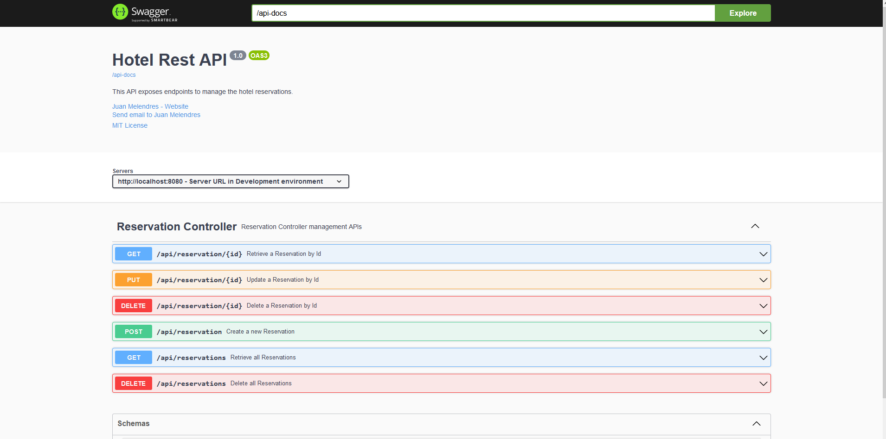

# Hotel Basic Reservation App

This project demonstrates the implementation of spring Boot framework for a Hotel Basic Reservation App simple CRUD.

## Business Requirements

    Crete a simple backend application for hotel to work with reservations.
    In the application it should be possible to:

        1. Create a new reservation
        2. Readd all of the reservation
        3. Change some values of one reservation by id, which already exists

## Technologies

* spring boot 3.1.3
* jdk17
* Maven3

## Getting Started

To get started with this project, you will need to have the following installed on your local machine:

* JDK 17+
* Maven 3+

## Build & Run

To build and run the project, follow these steps:

### Steps to Setup

**1. Clone the application**

```bash
git clone https://github.com/JuanMelendres/Hotel-App.git
```

**2. Navigate to the project directory:**
```bash
cd hotel
```

**3. Build the project:**
```bash
mvn clean install
```

**4. Run the project using maven**

```bash
mvn spring-boot:run
```

The app will start running at <http://localhost:8080>

**4. Test the project using maven**

```bash
mvn test
```

## HTTP Methods & Swagger implementation

### Reservation

| Method | Url                              | Description                                       | Sample Valid Request Body  |
| ------ |----------------------------------|---------------------------------------------------|----------------------------|
| GET    | /api/reservation/{id}            | Get a Reservation object by specifying its id.    |                            |
| GET    | /api/reservations                | Get all Reservations object.                      |                            |
| POST   | /api/reservation                 | Create a Reservation object.                      | [JSON](#newReservation)    |
| PUT    | /api/reservation/{id}            | Update a Reservation object by specifying its id. | [JSON](#updateReservation) |
| DELETE | /api/reservation/{id}            | Delete a Reservation object by specifying its id. |                            |
| DELETE | /api/reservations                | Delete all Reservations.                          |                            |

[Local Swagger Url](http://localhost:8080/swagger-ui/index.html#/)



##### <a id="newReservation">New Reservation</a>
```json
{
  "clientFullName": "Juan Melendres",
  "reservationDates": [
    "2023-10-28",
    "2023-11-04"
  ]
}
```

##### <a id="updateReservation">Update Reservation</a>
```json
{
  "id": 1,
  "clientFullName": "Juan Melendres",
  "roomNumber": 1,
  "reservationDates": [
    "2023-10-28",
    "2023-11-04"
  ]
}
```

